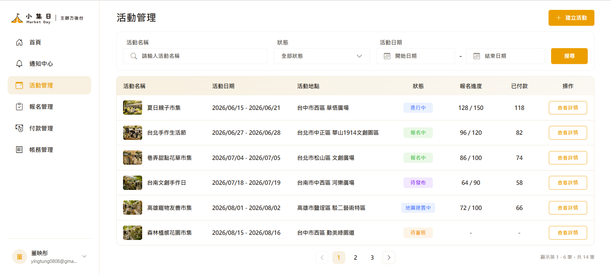

# 後台共用樣式與元件規範

> 範例畫面：主辦方後台 / 活動管理  


---

## 目的

後台頁面請統一使用共用樣式與元件，不要每個頁面各自重寫搜尋列、按鈕、表格、分頁樣式。

主辦方活動管理是目前的範例頁。

---

## 共用 SCSS

後台通用控制項樣式放在：

```txt
src/assets/scss/_dashboard-controls.scss
```

`styles.scss` 已引入：

```scss
@use "./assets/scss/dashboard-controls";
```

這支檔案負責：

- 後台頁首
- 頁面標題
- 搜尋列外框
- 搜尋 input
- 後台按鈕
- 建立按鈕

---

## 頁首寫法

```html
<header class="dashboard-page-header">
  <h1 class="dashboard-page-title">活動管理</h1>

  <button type="button" class="dashboard-btn primary dashboard-create-btn">
    <i class="bi bi-plus-lg"></i>
    建立活動
  </button>
</header>
```

---

## 搜尋列寫法

```html
<section class="dashboard-filter-bar organizer-event-filter">
  <label class="dashboard-search-field">
    <span class="dashboard-control-title">活動名稱</span>

    <span class="dashboard-search-input">
      <i class="bi bi-search"></i>
      <input type="search" placeholder="請輸入活動名稱" />
    </span>
  </label>

  <app-dropdown
    title="狀態"
    [options]="statusOptions"
    placeholder="全部狀態"
  ></app-dropdown>

  <app-date-range-selector selectorTitle="活動日期"></app-date-range-selector>

  <button type="button" class="dashboard-btn search">搜尋</button>
</section>
```

頁面 SCSS 只保留欄位比例：

```scss
.organizer-event-filter {
  grid-template-columns: minmax(220px, 1.2fr) minmax(170px, 0.8fr) minmax(300px, 1.4fr) 92px;
}
```

---

## 共用元件

### Dropdown

```html
<app-dropdown
  title="狀態"
  placeholder="全部狀態"
  [options]="statusOptions"
></app-dropdown>
```

樣式位置：

```txt
src/app/modules/shared/dropdown/dropdown.scss
```

### Date Range Selector

```html
<app-date-range-selector selectorTitle="活動日期"></app-date-range-selector>
```

樣式位置：

```txt
src/app/modules/shared/date-range-selector/date-range-selector.scss
```

### Data Table

```html
<app-dashboard-data-table
  [columns]="columns"
  [rows]="displayRows"
  emptyText="目前沒有活動資料"
  (actionClick)="onTableAction($event)"
></app-dashboard-data-table>
```

樣式位置：

```txt
src/app/modules/shared/dashboard/dashboard-data-table/dashboard-data-table.scss
```

表格內的「查看詳情」按鈕屬於表格元件，樣式寫在表格元件自己的 SCSS。

### Pagination

```html
<app-dashboard-pagination
  [currentPage]="currentPage"
  [pageSize]="pageSize"
  [totalItems]="totalItems"
  (pageChange)="onPageChange($event)"
></app-dashboard-pagination>
```

樣式位置：

```txt
src/app/modules/shared/dashboard/dashboard-pagination/dashboard-pagination.scss
```

分頁元件本身不設定 `margin-top`，和上方內容的距離由使用頁面自己決定。

---

## 寫法原則

頁面 SCSS 只負責：

- 頁面寬度
- 高度
- grid 欄位比例
- RWD 排版

不要在頁面 SCSS 重寫：

- input 樣式
- dropdown 樣式
- date input 樣式
- button 樣式
- table action button 樣式

---

## 簡單記法

頁面管排版。

`_dashboard-controls.scss` 管後台通用控制項。

共用 component 管自己的內部樣式。
